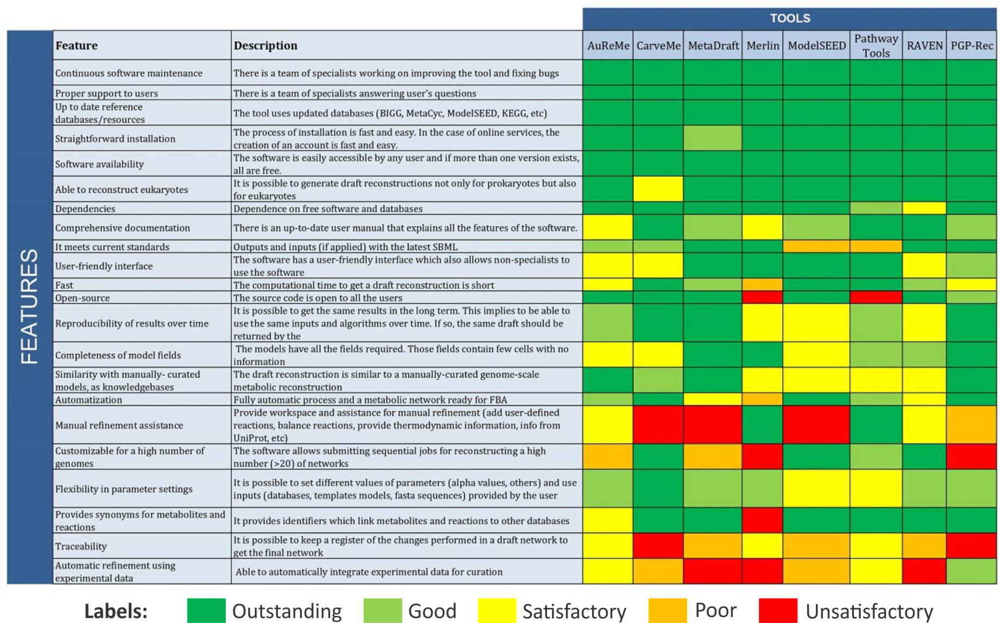

# PGP-Reconstruction


Pathway-Guided Pruning Reconstruction (PGP-Reconstruction) is a Python tool for reconstructing draft constraint-based Genome-Scale Metabolic Models (GEMs) by pruning a universal model, following the general strategy introduced by CarveMe while addressing limitations on existing tools. PGP-Reconstruction can be particularly useful for microbiome simulations, as it allows metabolites to be transported outside the cell via passive diffusion, even if they are irrelevant to the cell's metabolism.

### Key Features
- Reconstruct GEMs using a top-down approach (same as CarveMe and GapSeq)
- Models are particularly relevant for microbiome simulations
- Capable of representing a wide range of pathways
- Almost zero blocked reactions
- Usage of Rhea as a reaction database
- Usage of Uniprot as a protein database
- Accept several input formats, including annotation files

## Short algorithm description

The tool takes the organism's genome and species name as input, using the latter for taxonomic classification and core metabolism identification. It uses the genome to predict expressed reactions and pathways in the organism. In the universal model, reactions receive scores derived from the alignment score: reactions associated with aligned gene sequences in UniRef90 receive positive scores, whereas negative scores are assigned otherwise. The universal model is then "pruned" by maximizing the sum of reaction scores while ensuring network connectivity and biomass flux. 

### Input

PGP-Reconstruction requires two main pieces of information to function correctly: the organism's genome and the species' name. 

- **Genome:** This should be the complete genome of the organism of interest, protein sequences, or annotation data. It is used to predict expressed reactions and pathways in the organism and can be provided in one of two formats: sequences of nucleic acids or sequences of amino acids. If nucleic acids are given in a FASTA file (fna), Prodigal will be used to identify ORFs and translate them to amino acid sequences. If sequences of amino acids are given as input, it should receive the format of a FASTA file (faa) with multiple protein sequences. Finally, annotation files generated by Genbank (with the extensions '.gb', '.gbk' or '.genbank') or Prokka can be used as input.

- **Species Name:** This is used for taxonomic classification and identification of the core metabolism. It is passed as an input through the name of the sequence file. For example, if you are modeling *Escherichia coli*, your sequence file should be named `Escherichia_coli.faa` or `Escherichia_coli.gbk`. It should use the entire organism name; therefore, `e_coli.faa` should not be used. If the species' name is unknown, you can use its family, class, or genus classification.

Additional information can be provided to PGP-Reconstruction, which will improve the overall model quality:

- **Constraints** (Optional)**:** Users can create a constraints file that will be used during the model reconstruction. This file can include desired constraints, such as compounds that the model should be able to consume/produce, and environments where it should grow.
- **Ecocyc and KEGG Organisms databases** (Optional)**:** These databases are used to identify the core metabolism and redistribute reactions' scores. These files are optional, as you would need a subscription to KEGG/Ecocyc to have access to them.

### Output

The primary output of PGP-Reconstruction is a draft metabolic model of the desired organism. This model is presented as an SBML (Systems Biology Markup Language) file, which can be read and manipulated using various systems biology and bioinformatics tools. The model includes a comprehensive list of predicted reactions, growth media, and pathways.

The quality of the output model depends on the completeness of the input genome, how well annotated it is, and the effort put into creating the "Constraints" file.


## Libraries Used
`PGP-Reconstruction` uses several Python libraries to reconstruct models. The most relevant are:
- **CobraPy**: to load, write, and manipulate the model
- **ReFramed**: to formulate the optimization problem that will be solved by CPLEX
- **MinPath**: to predict the pathways present in the modeled organism

## Comparison with Main Alternative Tools

- **GapSeq** focuses on optimizing the sum of fluxes, while `PGP-Rec` maximizes the sum of scores, which we believe is a better approach for reconstructing metabolic models.
- **CarveMe** maximizes the sum of scores, but uses a smaller universal model derived from the BiGG database, limiting its ability to accurately represent certain pathways. `PGP-Rec` employs a larger universal model derived from the Rhea reaction database.
- **ModelSEED/KBase** leaves a high number of blocked reactions in draft models by default. `PGP-Rec` returns models with almost no blocked reactions by default.

Preliminary tests show that `PGP-Reconstruction` generates draft metabolic models with more reactions and pathways in common with manually curated models than those reconstructed by CarveMe and ModelSEED/KBase. Further testing and validation through a scientific publication are ongoing.

## Comparison with Other Alternative Tools

We adapted the table from [Mendoza et al. (2019)](https://genomebiology.biomedcentral.com/articles/10.1186/s13059-019-1856-1) to include `PGP-Rec`, as shown below:



Notes about the PGP-Rec classification on the table:
- **Fast**: `PGP-Reconstruction` is faster than GapSeq but slower than CarveMe and ModelSEED/KBase. Reconstructing a single model takes between 25-50 minutes on a standard modern computer (tests were performed on a Lenovo ThinkPad T490 notebook, with an Intel Core i5-8365U processor and 40GB of RAM).
- **Open-source**: while `PGP-Reconstruction` is open source, it relies on CPLEX, which is a commercial solver free for students and academics. Optionally, it can receive as input data from Ecocyc and KEGG Organisms, which are subscription-only databases.
- **Completeness of model fields**:  models reconstructed by`PGP-Reconstruction` will have included in their SBML file information about which pathways each reaction belongs to.
- **Manual Refinement Assistance**: `PGP-Reconstruction` doesn't provide a dedicated workspace for manual refinement. However, users can include constraints in an external file which will be taken into consideration during model reconstruction. Examples of constraints are: compounds the organism should consume/produce and environments where it should be capable of growing.
- **Customizability for Multiple Genomes**: `PGP-Reconstruction` can reconstruct one model per run. An external tool/code needs to be used to automatize the reconstruction of multiple models.
- **Automatic refinement using experimental data**: `PGP-Reconstruction` will load experimental data of gene essentiality from the [DEG database](http://origin.tubic.org/deg/public/index.php/download) and try to make essential in the model, genes that have been described as essential, if the gene has been identified during the alignment phase.


## Installation

PGP-Reconstruction can be installed using pip:

```bash
pip install pgp_reconstruction
```

PGP-Reconstruction automatically downloads and installs some dependencies during the first run, including: a slightly modified version of [MinPath](https://github.com/mgtools/MinPath), large databases from an [external server](https://files.ufz.de/~umb-pgp_reconstruction-01/), Prodigal from [its official GitHub repository](https://github.com/hyattpd/Prodigal/releases), and experimental data of gene essentiality from the [DEG database](http://origin.tubic.org/deg/public/index.php/download).

However, PGP-Reconstruction cannot install all dependencies automatically. You will need to install the following external dependencies manually:
- [Diamond](https://github.com/bbuchfink/diamond) (use the command `conda install -c bioconda diamond`)
- IBM [CPLEX](https://www.ibm.com/products/ilog-cplex-optimization-studio/cplex-optimizer) Optimizer. It is free for academic use.

### Troubleshooting

**Issue:** After running PGP-Reconstruction, you encounter the error message `TypeError: solve() got an unexpected keyword argument 'emphasis'`.

**Cause:** PGP-Reconstruction relies on the `reframed` Python library to formulate the optimization problem that CPLEX solves. The error indicates you might not have the most recent version of `reframed`.

**Solution:** You will need to manually update your `reframed` library. Follow these steps:

1. Visit the [reframed GitHub repository](https://github.com/cdanielmachado/reframed).
2. Download the project files.
3. Unzip the downloaded folder.
4. Navigate into the unzipped directory.
5. Install the library by running the command `pip install .` in your terminal.

These steps will ensure you are working with the latest version of `reframed`.


## Usage

After including the PGP-Reconstruction installation folder in your path environment, the simplest possible usage case would be:

```bash
pgprec Escherichia_coli.faa
```

If you do not wish to include PGP-Reconstruction in your path environment, you can use it as:

```bash
C:\[...]\Python\Python3X\Lib\site-packages\pgp_reconstruction\cli\pgprec.py Escherichia_coli.faa
```

A more complex usage would be:

```bash
pgprec Escherichia_coli.gbk --constraints constraints.txt --reference "Escherichia coli.xml"
```

## Further developments

PGP-Reconstruction uses [KEGG Organisms](https://www.genome.jp/kegg/catalog/org_list.html) and [Ecocyc](https://biocyc.org/biocyc-pgdb-list.shtml) to identify the core metabolism of the modeled species. These databases, however, are available via subscription only and can not be made publicly available. PGP-Reconstruction can still work while skipping this step, but it leads to slightly lower-quality models. In future versions of this tool, we would like to develop a public database that can be used to replace KEGG and Ecocyc for this specific task.


## License

PGP-Reconstruction is released under the [Apache Software License 2.0](https://www.apache.org/licenses/LICENSE-2.0).

## Support

If you encounter any issues or have any questions, please [open an issue](https://github.com/rcolpo/pgp_reconstruction/issues) or reach out to the [maintainer](https://github.com/rcolpo).

## Credits

This project (Nr. 100386143) is co-financed by means of taxation based on the budget adopted by the representatives of the Landtag of Saxony.

Developed by Rodrigo Amarante Colpo while working at the Helmholtz Centre for Environmental Research - UFZ.

Supervisors: Sabine Kleinsteuber, Jens Olaf Krömer, Florian Centler, and Peter Florian Stadler.


<p align="center">
  
  
  
</p>


